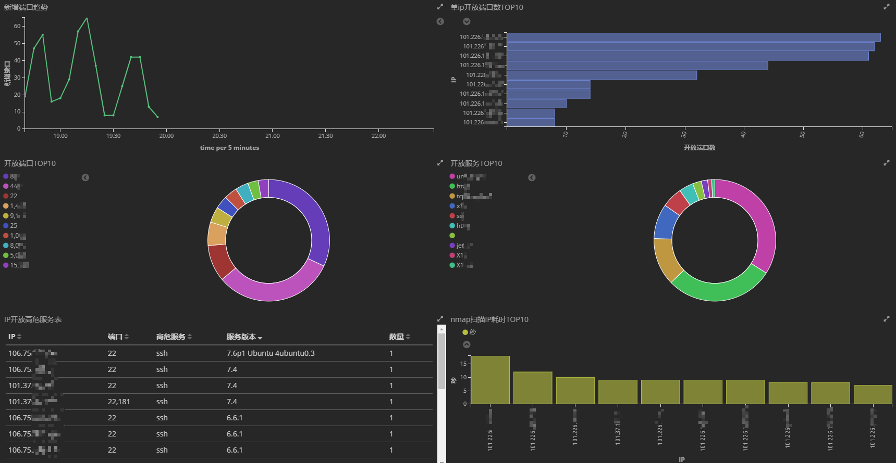

# asset-scan
[](https://www.golang.org/) [](https://www.elastic.co/downloads/elasticsearch) [](https://www.elastic.co/downloads/kibana)

## 简介

asset-scan用于甲方企业外网资产进行周期性扫描监控，对资产新增的端口服务进行自动化未授权访问/弱口令爆破检测并进行实时告警，
便于企业对外网暴露的攻击面进行收敛

结合kibana，使用者可随时搜索企业外网资产暴露的端口、服务和版本等信息;制作各类统计图，进行开放端口统计、新增服务版本分析和资产扫描耗时统计等;
使用Dashboard进行内部汇报展示等

目前支持ssh、redis、mysql、ftp、mongodb、postgresql和mssql七种服务的弱口令爆破，另外支持mongod、redis和memcached的未授权访问测试

**请使用者遵守《中华人民共和国网络安全法》，勿用于非授权的测试。**

## 功能特点

- 周期性扫描监控
- 自动化未授权访问/弱口令爆破
- 支持扫描白名单、配置热更新和告警控制
- 搜索、自定义统计图、多维度分析

## 图例展示

-- 配合Kibana强大的分析统计功能，各位可自定义其它统计图和表盘



-- 新增资产服务暴力破解成功通知


## 配置文件说明

```
nmap:
  path:                          #不指定则使用系统默认的nmap

masscan:
  path:                          #不指定则使用系统默认的masscan
  rate: 5000                     #masscan扫描速度，不建议设很大

es:
  address: 127.0.0.1:9200        #elasticsearch地址

scan:
  ipFile: ip.txt                 #包含扫描的ip范围文件，文件内容格式参照nmap -iL参数所支持的格式
  ipexcludeFile: ipExclude.txt   #包含需排除的ip范围文件，文件内容格式参照nmap --excludefile参数所支持的格式
  port: 1-65535                  #扫描端口范围
  userDict: user.txt             #对服务进行弱口令爆破的用户名字典
  passwordDict: password.txt     #对服务进行弱口令爆破的密码字典
  scan_interval: 30              #扫描间隔，单位：秒

observe:
  switch: on                     #观察者模式开关：（1）开启:on （2）关闭:off

mail:                            #告警邮箱设置，若观察者模式始终开启，则可忽略邮箱配置
  host: xxx.xxx.com
  port: 123
  username: xxx@xxx.com
  password: xxx
  from: xxx@xxx.com
  to: ["xxx@xxx.com","xxx@xxx.com"]
```

## 运行指南

- Linux环境运行，需要Nmap、Masscan、Es和Kibana 5.6.x版本，安装指南详见：[安装指南](./doc/install.md)
- 所需组件安装完毕后，从release中下载压缩包，对config.yaml进行配置，ip.txt中填入要扫描的IP段（格式参照nmap -iL参数所支持的格式），之后可直接输入`./asset-scan`运行
- 扫描初期，建议将config.yaml中的观察者模式开关设为`on`,避免造成告警轰炸（有新服务对外开放或暴力破解成功会发告警邮件）
- ipExclude.txt中为要排除扫描的IP段，user.txt和password.txt分别为用户名字段和密码字典

## Es字段说明

目前Es中有5个type：
- result

  包含每次资产基础探测扫描的数据：

- scanhistory 

  包含每次扫描的开始时间和结束时间

- addhistory 

  与最近一次扫描历史区间相比，新增的端口服务

- uphistory 

  与最近一次扫描历史区间相比，同一资产（具有相同IP、端口和协议）服务的更新情况

- bruteforce 

  包含对资产服务的未授权访问/暴力破解记录
  
## 讨论

与本项目有关的想法建议可联系作者，也欢迎一起讨论甲方安全建设/乙方安全服务/工控安全等

备注：github

